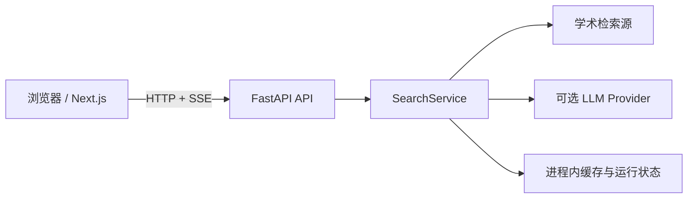
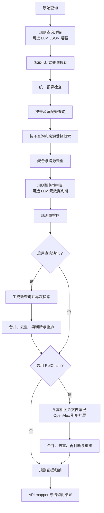

# 当前架构

## 系统边界

ScholarNavigator 采用前后端分离架构。浏览器中的 Next.js 前端只负责提交检索任务、展示状态和结果、执行本地导出；FastAPI 后端负责查询解析、外部学术检索、排序、归纳和运行状态管理。所有外部 API 与 LLM 凭据仅由后端读取。

## 后端分层

| 层 | 当前职责 |
| --- | --- |
| API | 健康检查、运行配置、异步检索生命周期、SSE、内部预览 |
| Service | 编排 `SearchService`，将内部结果映射为公共响应 |
| Agent | 查询理解、相关性判断、重排、查询演化、单层 RefChain、证据归纳 |
| Connector | 调用四个学术检索源，处理超时、重试、限速和字段转换 |
| Core | Pydantic 数据结构、统一论文身份归一化与去重、API 与评测 Schema |
| Evaluation | fake fixture 离线评测、真实 batch 结果评测和报告脚本 |

## SearchService 流程

候选合并、结构化输出和离线评测共用 `scholar_agent.core.identity`。稳定标识先按 DOI、arXiv、OpenAlex、Semantic Scholar、PubMed 的规范形式比较；没有共同稳定标识时，只有规范标题、年份和共同作者同时满足才允许保守合并，标识冲突不合并。去重函数可返回逐条合并规则与证据，供审计使用。

查询演化支持 `off`、`seed_expansion` 和 `coverage_gap`。旧策略保留用于复现实验；产品在开关启用时使用 `coverage_gap`，但 API、前端和 CLI 的开关默认关闭。新策略只根据查询分析、显式约束、初始候选和规则判断计算 `QueryCoverageGap`，不读取评测答案：结构化方法、数据集、必要词、论文类型或复合主题存在缺口且有可靠 seed 时，最多选 3 个高度/部分相关 seed、生成 2 条保留原主题的短查询。补充候选先按重复、排除词、主题和结构化维度做确定性质量门过滤，再进入原有 Judgement 与 Reranker。查询演化仍只执行一轮；RefChain 固定为单层。

## 执行预算

API 将预算映射为内部 `SearchBudget`，SearchService 使用单次运行共享的计量状态。初始检索记为逻辑第 1 轮，查询演化检索记为第 2 轮；并行子查询和 RefChain 不增加轮次。候选在每次跨源去重后、进入判断前按来源轮转稳定截断；RefChain 还会把剩余候选额度传给每个 seed。

查询理解和判断共用 LLM 调用数与 Token 计量，并在每次调用前检查调用数、已用 Token 和延迟。Provider 未返回 usage 时 Token 记为 0 并标记计量不精确；单次响应的实际 Token 无法预知，因此 Token 上限只能阻止后续调用。延迟使用单调时钟，在查询理解、检索、判断批次、查询演化、RefChain seed、重排和归纳边界检查；已经发出的 HTTP 请求不能中断，但返回后不会继续启动受限的外部或高成本阶段。预算停止返回已有部分结果，不视为任务失败。

检索批次另有明确的墙钟清理余量：达到查询预算截止时间后，调度器取消未开始 future、不再提交新子查询，并为运行中任务写入 `timeout`、排队任务写入 `not_started` 的终态。无共享运行状态的可序列化 synthetic/connector adapter 使用固定 `spawn` 子进程执行，父进程先 drain pipe 再有界 join，超时或取消时 terminate/kill 并回收；这避免永久阻塞线程留在 executor 中。生产 `retrieve_papers` 保留进程内 run cache/锁，依赖各 connector 的有限 HTTP timeout/retry，并由上层非阻塞 executor 截止等待。

## 检索源

| 来源 | 接口 | 当前行为 |
| --- | --- | --- |
| OpenAlex | Works API | 论文检索；同时为 RefChain 提供引用元数据 |
| arXiv | Atom API | 预印本检索与 XML 解析 |
| Semantic Scholar | Graph API | 支持无密钥访问和可选 API Key，并进行进程内限速 |
| PubMed | E-utilities | 通过 ESearch 与 EFetch 检索生物医学论文，支持可选 API Key |

单个来源失败不会终止整个检索；错误会进入 `source_stats`、`warnings`、SSE 事件和 `missing_evidence`。

逻辑子查询在 connector 前统一适配。产品默认使用 `adaptive`：每个来源先执行只做安全清理和硬限长的 `safe_original`，再按唯一候选量、核心词与约束覆盖、元数据完整性和来源状态判断是否执行 `compact_core`。预算耗尽、来源冷却、等价查询、信息保留不足或首轮结果充分时跳过第二请求；判断不读取 gold。`safe_original` 与无条件双变体的 `hybrid` 仍可由 Benchmark Runner 显式选择。arXiv 的请求间隔不因自适应策略缩短，用户显式来源集合不变。

单次 run 以“来源、保留字段语法和词序的规范化适配查询、limit”阻止真正等价的重复调度，并把复用请求的全部原子查询、用途和适配策略保留在诊断 provenance 中。跨阶段和跨 run 的成功结果仍由检索缓存复用。429 触发来源 cooldown；timeout/5xx 在 connector 内有限重试，同一 run 连续失败两次才打开熔断。Semantic Scholar 尊重 `Retry-After`，无 Key 时使用更保守的间隔；arXiv 连续调用默认间隔 3 秒。

每个 connector 使用统一诊断结构记录真实 HTTP 请求、实际重试、最终错误、缓存命中、限流等待和总延迟。`request_count` 包含首次请求和真正发出的重试；缓存命中只增加 `cache_hit_count`。SearchService 分开汇总普通检索与 RefChain 请求，`api_call_count` 等于检索请求、引用请求和 LLM 请求之和；逻辑检索调用数单独记录，不再用 `source_stats` 条数估算真实请求。

Benchmark 可在连接器边界启用集中式 Record/Replay：检索按来源、适配后查询、limit、适配策略及代码版本生成稳定键，`coverage_gap` 的演化请求另含策略命名空间；实验性初始规划键另含规划策略与版本，`current_rules` 继续读取旧键。RefChain 按 seed 标识符、limit 及连接器版本生成稳定键。`plan` 模式在绝对离线条件下运行真实 SearchService，先回放已有条目，再按实际初始规划、Query Evolution 查询和 RefChain seed 记录动态依赖；受限采集器串行消费计划，并以规划轮数、请求数、失败数、总时间、单源连续失败和取消信号为停止条件。

Replay 只读取经过 Schema、键和内容哈希校验的规范化响应，缺键直接失败且不回退网络；它不缓存 SearchService、Query Evolution 或 RefChain 的阶段输出，因此四组仍执行各自真实算法路径。结构合法的最终失败条目也属于覆盖，但与成功条目分开计数；`replay-ready` 只表示所有必需键已冻结，不代表上游请求全部成功。回放时记录的 live 延迟只驱动既有预算边界，以免零网络执行改变 adaptive 分支；实际回放延迟仍按本次墙钟时间报告。快照只保存公开论文元数据、警告和连接器诊断，不接触 gold。

PubMed 分别统计 ESearch 与 EFetch；无 ID 时跳过 EFetch。RefChain 的 OpenAlex seed 查询与引用查询归入引用请求；引用 work ID 使用每批最多 100 个的 OR filter 批量获取，并按 seed 中的原始顺序恢复结果。

## LLM 使用位置

LLM 默认关闭，当前可选用于三个位置：

1. 查询理解：要求返回 JSON，经 Pydantic 校验、来源白名单过滤后生成搜索计划；失败时保留诊断并使用规则结果。
2. 相关性判断：仅判断已检索候选的标题、摘要、venue 和标识符等元数据；按批次和候选上限调用，失败批次回退规则判断。
3. 语义查询规划：`llm_semantic` 只接收原始查询、显式约束、规则解析分面、运行档位和数量上限，保留原查询并最多接受两条补充查询。严格 Schema 和确定性校验会拒绝缺失核心主题或必要词、命中排除词、可疑标识符或引用、过长、重复及无关的输出；配置缺失、超时、预算停止、快照缺失或全部被拒绝时回退 `current_rules`，不会中断搜索。

三个 active Prompt 均由统一 loader 通过 `importlib.resources` 从 `src/scholar_agent/prompts/` 内的 Markdown 加载，不依赖工作目录。`manifest.json` 记录版本和 active 状态；渲染器以稳定 JSON 替换 `{{payload}}`，并用版本、system 文本和 user 模板计算 SHA-256。Prompt 缺失、为空或无效时不会调用 LLM，而是记录稳定 warning 并继续规则路径。

OpenAI-compatible 客户端以原生 HTTP 字段发送结构化输出和可选模板参数，不把 SDK 的 `extra_body` 包装器写入请求体。只有上游以 HTTP 400/422 明确拒绝 `response_format` 或模板参数时，客户端才在同一逻辑调用内执行一次兼容请求；去除 `response_format` 时增加 JSON-only 传输约束，返回值仍由现有严格 Schema 校验。错误只保留状态码、服务端类型/代码和脱敏摘要，不保存或输出凭据与完整响应正文。

LLM 语义规划具有独立于检索快照的 `live`、`record`、`record-missing` 和 `replay` 模式。稳定键包含 provider 类型、model、Prompt 名称/版本/hash、规范化输入、显式约束、规则分面、运行档位、温度、Token 上限和 Schema 版本，不包含密钥、gold、qrels、候选或完整 Prompt。动态计划先发现并冻结 LLM 规划键；只有该键可回放后才根据真实补充查询发现下游适配检索键，并把 LLM 键记录为依赖。纯 replay 不调用 LLM 或网络。

重排序、查询演化、RefChain 和证据归纳当前均为规则实现。系统不让 LLM 生成候选论文，也不读取论文全文。

## 显式查询约束

Real Search API 将 `time_range`、`venues`、`must_have_terms`、`excluded_terms`、`datasets` 和 `paper_types` 映射到统一的 `QueryConstraint`，再传入 SearchService 和 Query Understanding。字段合并优先级为“用户显式非空约束 > LLM 解析 > 规则解析”，未显式填写的字段保留推断结果；`current_year` 只解释相对时间表达，不代替显式时间范围。合并结果参与子查询、相关性判断和重排，并由 API 原样返回。显式 `source_preferences` 在请求校验阶段完成白名单、稳定去重和非空检查；省略时，计算机科学与机器学习默认 arXiv/OpenAlex，生物医学默认 PubMed/OpenAlex，未配置 Key 的 Semantic Scholar 不作为默认必调用来源。

初始查询规划支持默认 `current_rules` 及显式启用的实验策略，均保留原始查询。`prf_v1` 先只执行原始查询，按现有规则判断与排序取前 5 篇唯一候选，从标题和摘要中使用生产 query adapter 的分词与停用词提取至少跨 2 篇 seed 出现的 unigram/bigram；候选词按词频与固定倒数排名折扣稳定排序，最多 6 项，并以“原查询 + 反馈词”替换最低优先级派生查询。纯数字、年份、URL、论文标识和原查询词不进入反馈；无 seed、无有效词或首轮全失败时执行原 `current_rules` 剩余查询。该策略不调用 LLM、不增加计划子查询或来源请求预算，且默认关闭。`concept_projection` 只从规则式 Query Analysis 已有的 must-have/topic 概念中选取可在原查询精确定位的原文片段，按原文顺序去重并排除否定、格式、时间和数量约束；投影与已有查询不等价时仅替换最低优先级派生查询，不增加逻辑查询或来源请求预算，并记录输入概念、最终投影、被替换查询和跳过原因。`llm_constrained_rewrite` 同样只替换最低优先级派生查询：一次温度为 0 的严格 JSON 调用可压缩或重组原查询，并仅能新增固定白名单中的通用学术词；本地质量门强制保留专名、缩写、显式约束、否定与时间表达，拒绝新实体、标识、引用、标题猜测、过长或重复输出，任何拒绝、Schema/网络/预算/快照故障都逐字回退原 `current_rules` 查询列表。`controlled_relaxation` 最多补充核心主题和单个可靠分面；`facet_balanced` 在 profile 配额内选择互补分面；`disjunctive_facets` 独立重组析取规划；`current_plus_disjunctive` 在基线后追加至多一条通用 OR；`facet_union` 则按 dataset、method、task、topic 的稳定优先级选择至多一个独立分面。两种加法策略都先完整执行 `current_rules`，只用剩余延迟和候选预算，旧候选优先；`llm_semantic` 生成受限语义补充查询并经过本地校验。来源语法仍只由下游 adapter 处理，规划器不读取 gold、论文答案、候选或评测名称。默认策略是否切换只由冻结开发集后的独立验证门槛决定。

规则 Judgement 记录各约束维度覆盖率，多维覆盖可获得小幅提升，仅命中宽泛主题词时不能进入高度相关；must-have、excluded term 和时间范围仍执行确定性硬约束。Reranker 以相关性为主，来源只通过多源共同命中和元数据完整性形成通用信号，不按来源名称交换顺序。

排序默认继续使用 `current_rules`。显式实验模式 `rrf_fusion` 从检索响应保留的 `(source, adapted_query)` 有序列表重建来源排名，统一按论文身份合并，并以固定 `k=60`、列表等权计算 Reciprocal Rank Fusion；同一论文在同一列表重复出现时只取最佳名次，现有综合分只用于 RRF 同分裁决。run 内复用同一个物理请求不会重复加权，缺少可验证列表名次的候选会使该次实验明确失败。候选诊断同时记录列表贡献、RRF 分数、旧/新排名及 Top-20 换入换出状态；开关默认关闭，不改变检索、过滤或现有综合分。

规则 Judgement 的权重、阈值、惩罚和证据下限集中在版本化 `JudgementRuleConfig`，运行策略为 `current_rules` 或显式启用的 `calibrated_rules_v1`。每篇候选输出不含摘要正文的特征向量，记录分面命中、字段级分数、约束结果、元数据完整度和可加和分数组件。软参数只决定规则分数与分类阈值；excluded term 的强制不相关、显式 must-have 缺失和时间越界不能进入高度相关等保护在打分后独立执行，校准不能绕过。API、批处理和 Benchmark 配置均记录策略与配置哈希，产品默认仍为 `current_rules`。

## API 运行生命周期

1. `POST /api/v1/real/search/runs` 创建进程内任务并返回 `queued`。
2. 后台线程执行 SearchService；查询理解、检索源、去重、判断、重排、查询演化、RefChain 和归纳在真实执行位置通过回调产生结构化事件，路由按发生顺序写入 run store 并由 SSE 推送。
3. 阶段开始、完成和跳过事件分别更新 `current_stage`、`completed_stages` 和 `skipped_stages`；成功、失败、取消都只产生一个 `run_completed` 终止事件。
4. 取消采用协作式检查：停止后续子查询、LLM 批次、RefChain seed 和归纳，不再发起新请求；调度器同时取消 future 并终止可隔离的运行中子任务。生产 connector 的已发 HTTP 请求遵循其自身有界 timeout 自然结束，返回后立即停止后续阶段。

产品生命周期接口之外，保留两个调用真实 SearchService 的 `/internal/search/preview` 调试接口。

## 缓存和运行状态

- 检索缓存是进程内 LRU 风格缓存，键由来源、规范化适配查询和单源条数构成；默认 TTL 为 15 分钟、最多 256 项，可通过环境变量关闭或调整。
- 来源失败冷却状态同样只存在于当前进程。
- run store、事件和结果保存在 FastAPI 进程内；默认终态任务 TTL 为 1 小时、最多保留 200 个，清理不涉及运行中任务。
- 多进程或服务重启不会共享或保留上述状态。

## 当前限制

- 只使用论文元数据和摘要，不读取全文 PDF，也没有段落级证据检索。
- 返回格式开关尚未形成完全独立的输出路径。
- 任务队列、缓存和运行结果未持久化；协作式取消不能强制中断已经发出的单次 HTTP 请求。
- 外部检索质量与可用性受上游服务限流和故障影响。
- 尚未完成官方或完整公开 benchmark 的正式评测。
