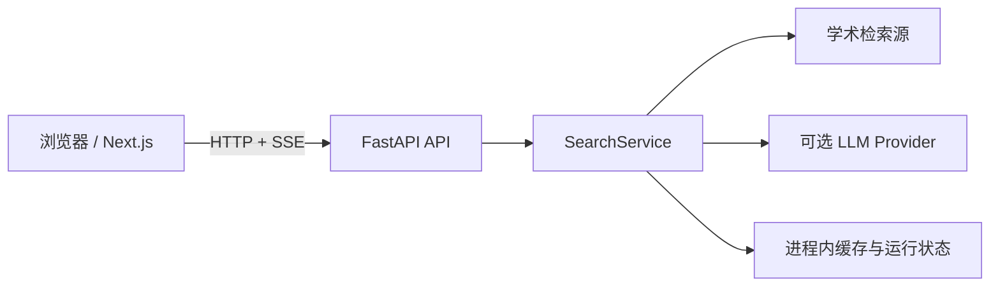
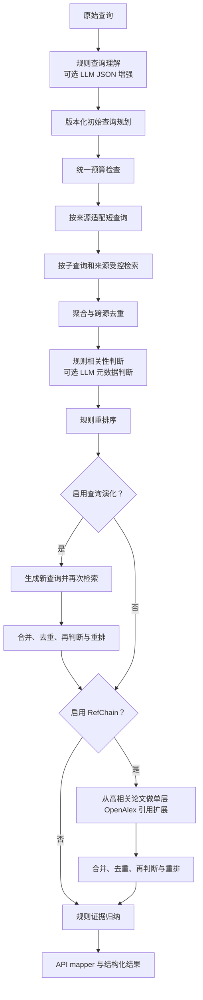

# 当前架构

## 系统边界

ScholarNavigator 采用前后端分离架构。浏览器中的 Next.js 前端只负责提交检索任务、展示状态和结果、执行本地导出；FastAPI 后端负责查询解析、外部学术检索、排序、归纳和运行状态管理。所有外部 API 与 LLM 凭据仅由后端读取。

## 后端分层

| 层 | 当前职责 |
| --- | --- |
| API | 健康检查、运行配置、异步检索生命周期、SSE、内部预览 |
| Service | 编排 `SearchService`，将内部结果映射为公共响应 |
| Agent | 查询理解、相关性判断、重排、查询演化、单层 RefChain、证据归纳 |
| Connector | 调用四个学术检索源，处理超时、重试、限速和字段转换 |
| Core | Pydantic 数据结构、统一论文身份归一化与去重、API 与评测 Schema |
| Evaluation | fake fixture 离线评测、真实 batch 结果评测和报告脚本 |

Evaluation 还包含离线 `run_manifest_v1` 完整性门禁。它复用 Snapshot/Replay 的稳定哈希、
query-only 计划输入、Prompt manifest、evaluator 版本与 checkpoint/resume 身份，递归验证
运行谱系和封闭输出清单；不进入 SearchService、connector、LLM 或 gold evaluator。
历史运行缺少契约字段时只返回 `legacy_metadata_incomplete`，不反向补造元数据。契约详情见
[`docs/run-provenance.md`](run-provenance.md)。

跨执行方式的离线一致性由 `execution_determinism_v1` 单独验证。它使用已有本地 Replay
fixture 驱动真实 SearchService，并比较重复、单条/批量、重排、串行/受控并发、完整/
checkpoint-resume 和取消隔离六种路径的规范化结果与语义事件；只按协议中的显式字段路径
排除瞬态耗时和运行标识，不改变列表顺序或忽略未知字段。该门禁不访问 gold、不计算效果
指标，也不替代 Snapshot 回归或官方 scorer。详见
[`docs/execution-determinism.md`](execution-determinism.md)。

四源异常隔离由 `retrieval_resilience_v1` 独立验证。该门禁从 Snapshot Replay 已使用的
connector provider 边界注入确定性 timeout、429、解析/分页异常、重复/冲突记录、部分
返回和多源失效，并继续执行真实 `retrieve_papers`、SearchService、统一身份、预算、排序
与事件路径。它验证健康结果保留、来源终态、全源失败、预算上界和错误脱敏，不改变 live
Record 的 retry/cooldown 语义，也不产生质量指标。详情见
[`docs/retrieval-resilience.md`](retrieval-resilience.md)。

冻结盲标包的人工标签接收由 `human_precision_adjudication_v1` 独立门禁负责。它先绑定
opaque item 集合、包文件树摘要、冻结 rubric 和统一身份/统计版本，再校验两轮独立匿名
标注、仅分歧裁决及既有包引用标签；输入 Schema 禁止携带 gold、case ID、策略名、来源、
排名或分数。覆盖未闭合时统计保持空值，只有 `validated` 状态才调用既有 change-only
Precision 统计；结果是内部人工审计，不是官方 scorer。详情见
[`docs/human-precision-adjudication.md`](human-precision-adjudication.md)。

双人离线交付由 `human_annotation_delivery_v1` 在上述门禁之前完成。它把当前 439 项与既有
包引用的 32 项闭合为 471 项，为两位标注者生成不同顺序、互不相交 alias 的完整盲化包，
并把全局身份映射隔离在 operator-only 文件中。静态界面支持本地进度、锁定和导出；回收器
验证覆盖、alias、锁定摘要与标签枚举后，才恢复为既有裁决输入。合成闭环不持久化标签或
统计，真实状态仍为等待双人标注。详情见
[`docs/human-annotation-delivery.md`](human-annotation-delivery.md)。

同一冻结盲标包还可由 `llm_relevance_judging_v1` 生成独立的内部 LLM proxy。该路径只把
opaque item ID、query、标题、摘要和年份作为非可信数据发送给配置的 LLM，两轮评审与仅
分歧裁决均使用严格 Schema、hash 锁定和有界 resume；所有标签锁定前不得读取私有 arm
映射。发布结果与人工标签目录隔离，不能冒充人工 Precision 或官方成绩，也不会改变默认
策略或 evidence 结论。详情见
[`docs/llm-relevance-judging.md`](llm-relevance-judging.md)。

`llm_relevance_judging_v1_1` 复用同一执行、锁定、解盲和统计路径，但为批量结构不稳定提供
独立协议代际：每个 LLM 请求只含一个 opaque item，继续使用供应商已证明支持的原生
`json_object`，客户端仍以 `extra=forbid` 的 Schema 拒绝任何额外、缺失、非法或错配字段。
contract、opaque identity、Prompt、runtime binding、batch identity 和输出目录均与 v1
隔离；v1 的部分锁定响应不能进入 v1.1。逻辑失败按固定两次 attempt 和固定退避在单次
执行内闭合，锁定成功的单项在 resume 时不再调用。

Benchmark 检查点和报告的运行中原子性由 `crash_consistency_v1` 单独验证。新运行把查询
记录、语义事件、checkpoint、run manifest 和最终报告写入同目录的增量代际；文件同步、
目录原子替换及最后提交标记共同定义权威恢复点，顶层旧格式文件只作兼容镜像。resume
只消费完整且哈希闭合的最后代际，损坏最新代会回退，并发 writer 会被拒绝。该门禁与
静态 `run_manifest_v1` 哈希完整性、`execution_determinism_v1` 跨执行方式一致性以及
质量评测彼此独立。详情见 [`docs/crash-consistency.md`](crash-consistency.md)。

符合上述新格式契约的运行可由 `reproduction_capsule_v1` 封装为确定性、数据-only 的
未压缩 USTAR 胶囊。胶囊绑定 query 顺序、Replay 原始响应、Prompt/配置/预算/evaluator、
完整提交代和预期规范化输出；安全导入拒绝路径穿越、链接、重复/未登记成员、资源超限及
谱系漂移。复放只调用宿主 checkout 的既有 SearchService Replay 路径，绝不执行归档内
代码，并验证零网络、零 LLM、零 Snapshot 写入。它只证明自包含性和跨目录可移植复现，
不替代静态完整性、执行确定性、崩溃恢复或检索质量评测。详情见
[`docs/reproduction-capsule.md`](reproduction-capsule.md)。

最终论文的字段证据由 `result_lineage_v1` 单独审计。生产去重函数在默认关闭的观察回调
中记录 connector 已映射 `Paper` 的稳定 hash、统一身份簇、字段候选和既有确定性采用/
拒绝规则；验证器可仅凭这些登记记录重建最终结果，并拒绝补造字段、错误来源引用和跨簇
借值。不开启观察时 SearchService 的结果、排序、去重数量和事件不变；旧冻结运行因缺少
字段候选与合并决策只返回 `not_eligible`。详见
[`docs/result-lineage.md`](result-lineage.md)。

Replay 业务阶段的环境封闭性由 `runtime_hermeticity_v1` 单独验证。它在依赖导入完成后
启用受控子进程钩子，只放行协议登记的两个精确输入文件和隔离输出目录，阻断网络/DNS、
`.env` 与 HOME 配置读取、敏感环境访问、目录外写入、缓存残留和未登记子进程。相同真实
SearchService fixture Replay 会在 hash seed、cwd/HOME/TMPDIR、时区、locale、线程变量
及污染环境下比较完整规范化结果、事件和字段血缘摘要；未知字段不会忽略。该门禁不替代
同环境执行确定性、跨目录复现胶囊或质量评测。详见
[`docs/runtime-hermeticity.md`](runtime-hermeticity.md)。

离线 baseline/candidate 实验的处理隔离由 `experiment_pairing_integrity_v1` 验证。
`comparison_plan_v1` 在执行前绑定同一 opaque query 集合、Replay/数据摘要、共同执行
契约、精确叶子处理变量与预声明排除；其 SHA-256 同时写入 `run_manifest_v1` 和原子提交
代的 generation-zero 配置。门禁保留成功、失败、取消和排除 query，不允许只分析共同
成功项，并逐 query 核对来源终态。该元数据不进入 SearchService，不改变检索、排序、
预算、事件或结果；只证明实验设计与覆盖完整性，不计算质量指标。详见
[`docs/experiment-pairing-integrity.md`](experiment-pairing-integrity.md)。

跨运行分片由 `sharded_execution_integrity_v1` 独立验证。`shard_plan_v1` 在执行前按
opaque query 的全局稳定序号和 shard 数执行固定 round-robin 分配，并把 plan、shard、
attempt 及显式 supersession 链同时绑定到 `run_manifest_v1` 和原子 generation-zero。
归并只选择每个 shard 的唯一谱系末端，按 plan 全局顺序保留成功、失败、取消和排除记录，
并登记 shard manifest、提交代、事件与血缘摘要；缺失 shard 返回 `not_ready`，重复、遗漏、
后验过滤或较优 attempt 选择均失败。该元数据也可随复现胶囊迁移，但不改变 SearchService、
排序、预算或事件语义。详情见
[`docs/sharded-execution-integrity.md`](sharded-execution-integrity.md)。

新格式运行可选启用 `resource_ledger_v1` 观察器。它直接订阅 SearchService 已有的
connector、预算、LLM、取消和终态事件，按稳定 operation identity 记录预留、消费、释放、
请求、分页、重试、cache 与未知 token/cost；不建立第二套请求或预算执行路径。账本随原子
completion generation 提交，并可登记到 `run_manifest_v1`、复现胶囊和所选 shard attempt。
`resource_accounting_integrity_v1` 再验证 run/query/operation 汇总及预算守恒，拒绝未提交、
被 supersede 或取消后的消耗。观察器默认关闭，启用前后 SearchService 结果、排序、去重、
事件和预算行为必须相同。详情见
[`docs/resource-accounting-integrity.md`](resource-accounting-integrity.md)。

## SearchService 流程

候选合并、结构化输出和离线评测共用 `scholar_agent.core.identity`。稳定标识先按 DOI、arXiv、OpenAlex、Semantic Scholar、S2ORC Corpus ID、PubMed 的规范形式比较；没有共同稳定标识时，只有规范标题、年份和共同作者同时满足才允许保守合并，标识冲突不合并。去重函数可返回逐条合并规则与证据；可选字段级血缘观察器还记录每个最终字段的来源候选和既有选择规则，供离线重建门禁使用。

查询演化支持 `off`、`seed_expansion` 和 `coverage_gap`。旧策略保留用于复现实验；产品在开关启用时使用 `coverage_gap`，但 API、前端和 CLI 的开关默认关闭。新策略只根据查询分析、显式约束、初始候选和规则判断计算 `QueryCoverageGap`，不读取评测答案：结构化方法、数据集、必要词、论文类型或复合主题存在缺口且有可靠 seed 时，最多选 3 个高度/部分相关 seed、生成 2 条保留原主题的短查询。补充候选先按重复、排除词、主题和结构化维度做确定性质量门过滤，再进入原有 Judgement 与 Reranker。查询演化仍只执行一轮；RefChain 固定为单层。

## 执行预算

API 将预算映射为内部 `SearchBudget`，SearchService 使用单次运行共享的计量状态。初始检索记为逻辑第 1 轮，查询演化检索记为第 2 轮；并行子查询和 RefChain 不增加轮次。候选在每次跨源去重后、进入判断前按来源轮转稳定截断；RefChain 还会把剩余候选额度传给每个 seed。

查询理解和判断共用 LLM 调用数与 Token 计量，并在每次调用前检查调用数、已用 Token 和延迟。Provider 未返回 usage 时，既有执行预算仍按兼容语义处理；可选资源账本则将该次 token/cost 明确记为 `not_available`，不以 0 冒充实测值。单次响应的实际 Token 无法预知，因此 Token 上限只能阻止后续调用。延迟使用单调时钟，在查询理解、检索、判断批次、查询演化、RefChain seed、重排和归纳边界检查；已经发出的 HTTP 请求不能中断，但返回后不会继续启动受限的外部或高成本阶段。预算停止返回已有部分结果，不视为任务失败。

检索批次另有明确的墙钟清理余量：达到查询预算截止时间后，调度器取消未开始 future、不再提交新子查询，并为运行中任务写入 `timeout`、排队任务写入 `not_started` 的终态。无共享运行状态的可序列化 synthetic/connector adapter 使用固定 `spawn` 子进程执行，父进程先 drain pipe 再有界 join，超时或取消时 terminate/kill 并回收；这避免永久阻塞线程留在 executor 中。生产 `retrieve_papers` 保留进程内 run cache/锁，依赖各 connector 的有限 HTTP timeout/retry，并由上层非阻塞 executor 截止等待。

## 检索源

| 来源 | 接口 | 当前行为 |
| --- | --- | --- |
| OpenAlex | Works API | 论文检索；同时为 RefChain 提供引用元数据 |
| arXiv | Atom API | 预印本检索与 XML 解析 |
| Semantic Scholar | Graph API | 支持无密钥访问和可选 API Key，并进行进程内限速 |
| PubMed | E-utilities | 通过 ESearch 与 EFetch 检索生物医学论文，支持可选 API Key |
| Local BM25 | 配置化 JSONL | 默认关闭；只索引 `title + abstract`，显式映射稳定文档 ID 与论文标识 |

产品默认来源仍固定为 OpenAlex、arXiv、Semantic Scholar 和 PubMed；`local_bm25` 只在调用方同时显式选择来源并提供语料/字段配置时注册到本次运行。它使用 `rank_bm25` 的确定性 Unicode word/casefold tokenizer，按分数降序、文档 ID 升序打破并列。磁盘索引缓存指纹包含语料 SHA-256、字段映射、tokenizer/connector 版本和全部 BM25 参数；不同语料或字段配置不能共享 Snapshot key。连接器不接收 Dataset Adapter、qrels、gold、crosswalk 或 case ID，返回的身份只能来自配置字段或配置为稳定身份的原始文档 ID。

单个来源失败不会终止整个检索；错误会进入 `source_stats`、`warnings`、SSE 事件和 `missing_evidence`。

逻辑子查询在 connector 前统一适配。产品默认使用 `adaptive`：每个来源先执行只做安全清理和硬限长的 `safe_original`，再按唯一候选量、核心词与约束覆盖、元数据完整性和来源状态判断是否执行 `compact_core`。预算耗尽、来源冷却、等价查询、信息保留不足或首轮结果充分时跳过第二请求；判断不读取 gold。`safe_original` 与无条件双变体的 `hybrid` 仍可由 Benchmark Runner 显式选择。arXiv 的请求间隔不因自适应策略缩短，用户显式来源集合不变。

单次 run 以“来源、保留字段语法和词序的规范化适配查询、limit”阻止真正等价的重复调度，并把复用请求的全部原子查询、用途和适配策略保留在诊断 provenance 中。跨阶段和跨 run 的成功结果仍由检索缓存复用。429 触发来源 cooldown；timeout/5xx 在 connector 内有限重试，同一 run 连续失败两次才打开熔断。Semantic Scholar 尊重 `Retry-After`，无 Key 时使用更保守的间隔；arXiv 连续调用默认间隔 3 秒。

每个 connector 使用统一诊断结构记录真实 HTTP 请求、实际重试、最终错误、缓存命中、限流等待和总延迟。`request_count` 包含首次请求和真正发出的重试；缓存命中只增加 `cache_hit_count`。SearchService 分开汇总普通检索与 RefChain 请求，`api_call_count` 等于检索请求、引用请求和 LLM 请求之和；逻辑检索调用数单独记录，不再用 `source_stats` 条数估算真实请求。

Benchmark 可在连接器边界启用集中式 Record/Replay：检索按来源、适配后查询、limit、适配策略及代码版本生成稳定键，`local_bm25` 的动态 connector version 另绑定上述索引指纹；`coverage_gap` 的演化请求另含策略命名空间；实验性初始规划键另含规划策略与版本，`current_rules` 继续读取旧键。RefChain 按 seed 标识符、limit 及连接器版本生成稳定键。`plan` 模式在绝对离线条件下运行真实 SearchService，先回放已有条目，再按实际初始规划、Query Evolution 查询和 RefChain seed 记录动态依赖；受限采集器串行消费计划，并以规划轮数、请求数、失败数、总时间、单源连续失败和取消信号为停止条件。

Replay 只读取经过 Schema、键和内容哈希校验的规范化响应，缺键直接失败且不回退网络；它不缓存 SearchService、Query Evolution 或 RefChain 的阶段输出，因此四组仍执行各自真实算法路径。结构合法的最终失败条目也属于覆盖，但与成功条目分开计数；`replay-ready` 只表示所有必需键已冻结，不代表上游请求全部成功。回放时记录的 live 延迟只驱动既有预算边界，以免零网络执行改变 adaptive 分支；实际回放延迟仍按本次墙钟时间报告。快照只保存公开论文元数据、警告和连接器诊断，不接触 gold。

PubMed 分别统计 ESearch 与 EFetch；无 ID 时跳过 EFetch。RefChain 的 OpenAlex seed 查询与引用查询归入引用请求；引用 work ID 使用每批最多 100 个的 OR filter 批量获取，并按 seed 中的原始顺序恢复结果。

## LLM 使用位置

LLM 默认关闭，当前可选用于三个位置：

1. 查询理解：要求返回 JSON，经 Pydantic 校验、来源白名单过滤后生成搜索计划；失败时保留诊断并使用规则结果。
2. 相关性判断：仅判断已检索候选的标题、摘要、venue 和标识符等元数据；按批次和候选上限调用，失败批次回退规则判断。
3. 语义查询规划：`llm_semantic` 只接收原始查询、显式约束、规则解析分面、运行档位和数量上限，保留原查询并最多接受两条补充查询。严格 Schema 和确定性校验会拒绝缺失核心主题或必要词、命中排除词、可疑标识符或引用、过长、重复及无关的输出；配置缺失、超时、预算停止、快照缺失或全部被拒绝时回退 `current_rules`，不会中断搜索。

三个 active Prompt 均由统一 loader 通过 `importlib.resources` 从 `src/scholar_agent/prompts/` 内的 Markdown 加载，不依赖工作目录。`manifest.json` 记录版本和 active 状态；渲染器以稳定 JSON 替换 `{{payload}}`，并用版本、system 文本和 user 模板计算 SHA-256。Prompt 缺失、为空或无效时不会调用 LLM，而是记录稳定 warning 并继续规则路径。

论文标题、摘要、作者、venue、URL 与来源错误按
`untrusted_metadata_isolation_v1` 视为外部非可信数据。权威 `Paper`、统一身份与排序输入保持
原值；relevance judgement 只接收单个带 `untrusted_data` 标记的 user JSON envelope，
消息角色固定为 `system,user`，未知响应字段使该批回退规则。公共链接只激活无凭据的
HTTP(S)，Markdown 与错误诊断在展示边界转义或散列。可选 hash-only 隔离记录可并入字段
血缘并登记到新格式 run manifest/复现胶囊，不启用时不改变生产结果。协议与离线门禁见
[`docs/untrusted-metadata-isolation.md`](untrusted-metadata-isolation.md)。

OpenAI-compatible 客户端以原生 HTTP 字段发送结构化输出和可选模板参数，不把 SDK 的 `extra_body` 包装器写入请求体。只有上游以 HTTP 400/422 明确拒绝 `response_format` 或模板参数时，客户端才在同一逻辑调用内执行一次兼容请求；去除 `response_format` 时增加 JSON-only 传输约束，返回值仍由现有严格 Schema 校验。错误只保留状态码、服务端类型/代码和脱敏摘要，不保存或输出凭据与完整响应正文。

评审后端资格检查通过独立的 `judge_backend_qualification_v1` 路径使用同一
OpenAI-compatible 客户端，但不进入 SearchService、检索 Prompt 或生产判断。它只向运行时
已配置候选发送固定合成 canary，并把 provider/model、请求/响应 hash、原生模式诊断和供应商
usage 写入隔离证据；endpoint、host、认证信息、响应正文及标签不持久化。compatibility
fallback、额外 HTTP attempt、Schema 或 item binding 失败都会使候选不合格，不会触发
471 项全量评审。协议见
[`docs/judge-backend-qualification.md`](judge-backend-qualification.md)。

LLM 语义规划具有独立于检索快照的 `live`、`record`、`record-missing` 和 `replay` 模式。稳定键包含 provider 类型、model、Prompt 名称/版本/hash、规范化输入、显式约束、规则分面、运行档位、温度、Token 上限和 Schema 版本，不包含密钥、gold、qrels、候选或完整 Prompt。动态计划先发现并冻结 LLM 规划键；只有该键可回放后才根据真实补充查询发现下游适配检索键，并把 LLM 键记录为依赖。纯 replay 不调用 LLM 或网络。

重排序、查询演化、RefChain 和证据归纳当前均为规则实现。系统不让 LLM 生成候选论文，也不读取论文全文。

## 显式查询约束

Real Search API 将 `time_range`、`venues`、`must_have_terms`、`excluded_terms`、`datasets` 和 `paper_types` 映射到统一的 `QueryConstraint`，再传入 SearchService 和 Query Understanding。字段合并优先级为“用户显式非空约束 > LLM 解析 > 规则解析”，未显式填写的字段保留推断结果；`current_year` 只解释相对时间表达，不代替显式时间范围。合并结果参与子查询、相关性判断和重排，并由 API 原样返回。显式 `source_preferences` 在请求校验阶段完成白名单、稳定去重和非空检查；省略时，计算机科学与机器学习默认 arXiv/OpenAlex，生物医学默认 PubMed/OpenAlex，未配置 Key 的 Semantic Scholar 不作为默认必调用来源。

初始查询规划支持默认 `current_rules` 及显式启用的实验策略，均保留原始查询。`prf_v1` 先只执行原始查询，按现有规则判断与排序取前 5 篇唯一候选，从标题和摘要中使用生产 query adapter 的分词与停用词提取至少跨 2 篇 seed 出现的 unigram/bigram；候选词按词频与固定倒数排名折扣稳定排序，最多 6 项，并以“原查询 + 反馈词”替换最低优先级派生查询。纯数字、年份、URL、论文标识和原查询词不进入反馈；无 seed、无有效词或首轮全失败时执行原 `current_rules` 剩余查询。该策略不调用 LLM、不增加计划子查询或来源请求预算，且默认关闭。`concept_projection` 只从规则式 Query Analysis 已有的 must-have/topic 概念中选取可在原查询精确定位的原文片段，按原文顺序去重并排除否定、格式、时间和数量约束；投影与已有查询不等价时仅替换最低优先级派生查询，不增加逻辑查询或来源请求预算，并记录输入概念、最终投影、被替换查询和跳过原因。`llm_constrained_rewrite` 同样只替换最低优先级派生查询：一次温度为 0 的严格 JSON 调用可压缩或重组原查询，并仅能新增固定白名单中的通用学术词；本地质量门强制保留专名、缩写、显式约束、否定与时间表达，拒绝新实体、标识、引用、标题猜测、过长或重复输出，任何拒绝、Schema/网络/预算/快照故障都逐字回退原 `current_rules` 查询列表。`controlled_relaxation` 最多补充核心主题和单个可靠分面；`facet_balanced` 在 profile 配额内选择互补分面；`disjunctive_facets` 独立重组析取规划；`current_plus_disjunctive` 在基线后追加至多一条通用 OR；`facet_union` 则按 dataset、method、task、topic 的稳定优先级选择至多一个独立分面。两种加法策略都先完整执行 `current_rules`，只用剩余延迟和候选预算，旧候选优先；`llm_semantic` 生成受限语义补充查询并经过本地校验。来源语法仍只由下游 adapter 处理，规划器不读取 gold、论文答案、候选或评测名称。默认策略是否切换只由冻结开发集后的独立验证门槛决定。

`semantic_seed_expansion` 是默认关闭的候选扩展策略。它在完整 `current_rules` 首轮判断和重排后，先为缺少 Semantic Scholar Paper ID 的高排名候选选取一个来源已有的 DOI、arXiv ID、PMID 或 S2ORC Corpus ID，并以至多一次官方 paper batch 请求解析精确 Paper ID。映射只有在官方外部标识与原候选共享稳定标识且不存在任何同类标识冲突时才可使用；标题、作者和摘要不参与解析，映射也不写回普通候选。随后按原排名选择最多 3 个直接或解析得到的唯一 seed，向官方 recommendations endpoint 发起至多 1 个批量请求、最多接收 100 篇推荐。推荐结果继续经过统一身份去重、候选预算、原有 Judgement 与 Reranker；无有效 seed、解析/推荐失败、限流或响应 Schema 异常时保留首轮结果并记录明确终态。解析和推荐分别使用独立 Snapshot 键并统一归入 reference 成本；Snapshot Plan/Record/Replay 将该后检索扩展组的 `initial_retrieval` key 冻结为同查询策略 baseline 组的集合，防止目录中其他实验的既有 key 改变配对首轮，Replay 逐键复现响应且不访问网络。

规则 Judgement 记录各约束维度覆盖率，多维覆盖可获得小幅提升，仅命中宽泛主题词时不能进入高度相关；must-have、excluded term 和时间范围仍执行确定性硬约束。Reranker 以相关性为主，来源只通过多源共同命中和元数据完整性形成通用信号，不按来源名称交换顺序。

排序默认继续使用 `current_rules`。显式实验模式 `rrf_fusion` 从检索响应保留的 `(source, adapted_query)` 有序列表重建来源排名，统一按论文身份合并，并以固定 `k=60`、列表等权计算 Reciprocal Rank Fusion；同一论文在同一列表重复出现时只取最佳名次，现有综合分只用于 RRF 同分裁决。run 内复用同一个物理请求不会重复加权，缺少可验证列表名次的候选会使该次实验明确失败。候选诊断同时记录列表贡献、RRF 分数、旧/新排名及 Top-20 换入换出状态；开关默认关闭，不改变检索、过滤或现有综合分。

规则 Judgement 的权重、阈值、惩罚和证据下限集中在版本化 `JudgementRuleConfig`，运行策略为 `current_rules` 或显式启用的 `calibrated_rules_v1`。每篇候选输出不含摘要正文的特征向量，记录分面命中、字段级分数、约束结果、元数据完整度和可加和分数组件。软参数只决定规则分数与分类阈值；excluded term 的强制不相关、显式 must-have 缺失和时间越界不能进入高度相关等保护在打分后独立执行，校准不能绕过。API、批处理和 Benchmark 配置均记录策略与配置哈希，产品默认仍为 `current_rules`。

Judgement 与 Reranker 另提供默认不启用的纯观察 catalog/trace：它们读取已经由生产路径
生成的特征向量、rerank breakdown 和真实排序键，不重新实现评分。离线
`ranking_decision_audit_v1` 将标题 tie-break 转成 query 内稳定序位并结合 opaque identity、
字段合并血缘重建类别、全排序和 Top-20 终态；观察器不进入 SearchService 返回 Schema，
不改变结果、预算或事件。该审计只解释规则执行，契约与命令见 `docs/evaluation.md`。

Reranker 另暴露显式、默认关闭的 `deterministic_tiebreak_v2`。它只在类别、综合分、
Judgement 分、引用、年份和标题 `casefold` 六个生产主键逐值完全相等时参与排序，不使用
浮点容差扩大 tie。稳定键依次采用统一身份中的精确稳定标识、保守的精确
title+author+year 身份；两者都不可用时，必须绑定字段血缘已登记的来源记录引用、来源名和
规范化字段摘要。缺少引用或同组稳定键冲突会明确失败，不回退输入位置。SearchService 未传入
该策略，产品默认仍由 `original_index_v1` 决胜；资格门禁只对同一个已去重候选池做输入反序、
来源块、固定随机和 shard 完成顺序置换，不会重新合并来源字段或改变事件。

正式验证就绪发布层由 `validation_readiness_bundle_v1` 提供。它不进入 SearchService、
Replay 或 evaluator，只读取已经跟踪的聚合证据、协议与阻断记录，以历史 SHA-256 绑定来源，
再校验跨报告计数、默认策略状态和声明边界。发布包只保存脱敏索引、声明矩阵、阻断输入、
检查清单和只读验证命令，不复制 query/论文正文、私有映射或逐查询诊断。通过状态
`ready_with_declared_blockers` 仅表示这些证据可离线复核；Full1000、真实人工 Precision 与
官方 scorer/schema 仍是独立正式验证前置条件。详见
[`docs/validation-readiness.md`](validation-readiness.md)。

发布证据与实现之间的语义新鲜度由 `validation_evidence_freshness_v1` 单独验证。契约把当前
readiness 中的机器证据、只读门禁和声明绑定到精确文件组件及稳定 basis digest；代码、协议、
配置、数据身份、前端转换、CLI、统计实现或声明源变化只沿显式依赖边传播，并输出最小重跑
集合。已登记 Python 文件的纯注释/docstring 变化使用 AST 证明无语义影响，依赖重命名和未登记
生产文件变化则 fail closed。该门禁不重算质量指标、不重写历史证据，也不解除三个正式阻断。
详见 [`docs/validation-evidence-freshness.md`](validation-evidence-freshness.md)。

软件工程发布闭包由 `release_candidate_reproducibility_v1` 独立验证。它从固定 Git 提交生成两个
隔离源码树，绑定精确源码清单、工具链、依赖声明与锁文件、归档元数据和离线 webpack 构建，
并逐字节比较 wheel、前端静态文件、源码归档、SBOM 与发布 manifest。历史前端路径漂移由
`frontend_reproducible_build_v1` 通过源码摘要绑定的 canonical staging 修复，且路由、静态
引用、hydration 与 API 类型契约保持完整；该历史证据中的完整发布候选因 Python 根依赖未
精确锁定而保持 `not_qualified`。后续 `python_dependency_lock_v1` 已形成精确声明和闭包，
但在双 venv 离线安装通过前不会改写这项历史结论或 readiness 状态。该工程声明不包含运行
结果、质量指标或官方提交物。详见
[`docs/release-candidate-reproducibility.md`](release-candidate-reproducibility.md)。

部分完成样本的外推边界由 `completion_bias_audit_v1` 独立审计。该层只读取检索前可见的
query 结构、稳定顺序和既有查询连通分量，通过精确 opaque identity 闭合 Full1000、
Record162 与 Record160；它不读取检索候选、来源产出、gold 或质量指标，也不进入
SearchService。审计结果只限制 Record160 结论的适用总体，不推断未完成查询表现。契约与命令见
[`docs/completion-bias-audit.md`](completion-bias-audit.md)。

未来官方 scorer 的交接边界由 `external_scorer_handoff_v1` 单独验证。它从已提交
`final_returned` 构造绑定 run manifest 与 commit generation 的 canonical handoff，并在受控
子进程复用 runtime hermeticity 的最小环境、文件和网络隔离原则。package 与输入执行前后均按
SHA-256 校验，输出必须严格覆盖 query、满足登记 Schema 和命名空间并在双次运行中一致。当前
Record160 缺少新式运行绑定、Full1000 未完成且官方 package/Schema 未提供，因此真实资格保持
blocked；合成 scorer 只能证明接入工程链路。详见
[`docs/external-scorer-handoff.md`](external-scorer-handoff.md)。

`JudgementRuleConfig.lexical_normalization_policy` 默认固定为 `off`。显式实验值 `lexical_normalization_v1` 只在 topic、must-have、method、domain 的既有文本证据匹配失败后尝试 NFKC/casefold、Unicode 标点与连字符分词、点分字母缩写、英文所有格和固定的保守单复数归一；它不扩展语义、不做模糊匹配，也不作用于 dataset、exclude、paper type、venue、time 或 task。命中仍使用原字段权重、分面上限、负分、阈值、类别门和 Reranker。特征向量为每个新增证据记录原词、规范形式、标题/摘要字段和受分面上限约束后的边际分数；旧 Snapshot 未含该字段时按空列表兼容。

## API 运行生命周期

公共结果映射与离线 evaluator 共享 `highly_and_partial` 正式选择器：SearchService 的
Top-K `ranked_papers` 只有 `highly_relevant` 和 `partially_relevant` 会进入公共论文数组，
`weakly_relevant` 仍保留为明确过滤诊断，不再被展示为“部分相关”。每条公共
`RankedPaper` 包含统一 `result_identity` 与展示变换前的 `authority_digest`；未知年份保持
`null`。前端论文卡直接消费 API 顺序，并以 `result_identity` 作为 React key，危险 URL 的
协议检查只控制链接是否可点击，不参与数组过滤。该交付边界由
[`top20_delivery_fidelity_v1`](top20-delivery-fidelity.md) 离线门禁验证。

1. `POST /api/v1/real/search/runs` 创建进程内任务并返回 `queued`。
2. 后台线程执行 SearchService；查询理解、检索源、去重、判断、重排、查询演化、RefChain 和归纳在真实执行位置通过回调产生结构化事件，路由按发生顺序写入 run store 并由 SSE 推送。
3. 阶段开始、完成和跳过事件分别更新 `current_stage`、`completed_stages` 和 `skipped_stages`；成功、失败、取消都只产生一个 `run_completed` 终止事件。
4. 取消采用协作式检查：停止后续子查询、LLM 批次、RefChain seed 和归纳，不再发起新请求；调度器同时取消 future 并终止可隔离的运行中子任务。生产 connector 的已发 HTTP 请求遵循其自身有界 timeout 自然结束，返回后立即停止后续阶段。

产品生命周期接口之外，保留两个调用真实 SearchService 的 `/internal/search/preview` 调试接口。

## 缓存和运行状态

- 检索缓存是进程内 LRU 风格缓存，键由来源、规范化适配查询和单源条数构成；默认 TTL 为 15 分钟、最多 256 项，可通过环境变量关闭或调整。
- 来源失败冷却状态同样只存在于当前进程。
- run store、事件和结果保存在 FastAPI 进程内；默认终态任务 TTL 为 1 小时、最多保留 200 个，清理不涉及运行中任务。
- 多进程或服务重启不会共享或保留上述状态。

## 当前限制

- 只使用论文元数据和摘要，不读取全文 PDF，也没有段落级证据检索。
- 返回格式开关尚未形成完全独立的输出路径。
- 任务队列、缓存和运行结果未持久化；协作式取消不能强制中断已经发出的单次 HTTP 请求。
- 外部检索质量与可用性受上游服务限流和故障影响。
- 尚未完成官方或完整公开 benchmark 的正式评测。

Python 发布依赖由 `python_dependency_lock_v1` 单独封闭：运行与开发直接声明分组，
完整闭包从当前可验证的 distribution metadata 确定性重建，wheel 的 `Requires-Dist`
只接受运行直接依赖。离线安装资格只能消费已有 wheel 介质并通过两套隔离 venv；介质
不完整时返回 `not_ready`，不会联网补包，也不会将“精确锁定”误报为“可离线安装”。
协议与命令见 `docs/python-dependency-lock.md`。
