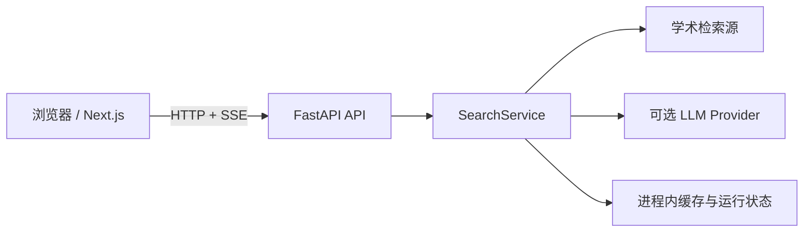
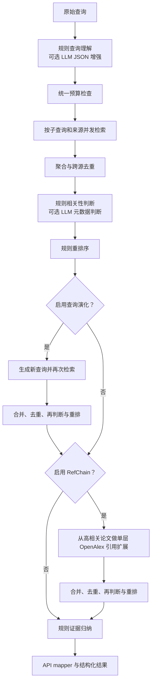

# 当前架构

## 系统边界

ScholarNavigator 采用前后端分离架构。浏览器中的 Next.js 前端只负责提交检索任务、展示状态和结果、执行本地导出；FastAPI 后端负责查询解析、外部学术检索、排序、归纳和运行状态管理。所有外部 API 与 LLM 凭据仅由后端读取。

## 后端分层

| 层 | 当前职责 |
| --- | --- |
| API | 健康检查、运行配置、异步检索生命周期、SSE、内部预览 |
| Service | 编排 `SearchService`，将内部结果映射为公共响应 |
| Agent | 查询理解、相关性判断、重排、查询演化、单层 RefChain、证据归纳 |
| Connector | 调用四个学术检索源，处理超时、重试、限速和字段转换 |
| Core | Pydantic 数据结构、论文去重、API 与评测 Schema |
| Evaluation | fake fixture 离线评测、真实 batch 结果评测和报告脚本 |

## SearchService 流程

查询演化最多执行当前实现定义的一轮补充检索；RefChain 固定为单层。归纳阶段只使用排名结果、论文元数据和判断阶段生成的证据行。

## 执行预算

API 将预算映射为内部 `SearchBudget`，SearchService 使用单次运行共享的计量状态。初始检索记为逻辑第 1 轮，查询演化检索记为第 2 轮；并行子查询和 RefChain 不增加轮次。候选在每次跨源去重后、进入判断前按来源轮转稳定截断；RefChain 还会把剩余候选额度传给每个 seed。

查询理解和判断共用 LLM 调用数与 Token 计量，并在每次调用前检查调用数、已用 Token 和延迟。Provider 未返回 usage 时 Token 记为 0 并标记计量不精确；单次响应的实际 Token 无法预知，因此 Token 上限只能阻止后续调用。延迟使用单调时钟，在查询理解、检索、判断批次、查询演化、RefChain seed、重排和归纳边界检查；已经发出的 HTTP 请求不能中断，但返回后不会继续启动受限的外部或高成本阶段。预算停止返回已有部分结果，不视为任务失败。

## 检索源

| 来源 | 接口 | 当前行为 |
| --- | --- | --- |
| OpenAlex | Works API | 论文检索；同时为 RefChain 提供引用元数据 |
| arXiv | Atom API | 预印本检索与 XML 解析 |
| Semantic Scholar | Graph API | 支持无密钥访问和可选 API Key，并进行进程内限速 |
| PubMed | E-utilities | 通过 ESearch 与 EFetch 检索生物医学论文，支持可选 API Key |

单个来源失败不会终止整个检索；错误会进入 `source_stats`、`warnings`、SSE 事件和 `missing_evidence`。

## LLM 使用位置

LLM 默认关闭，当前只可选用于两个位置：

1. 查询理解：要求返回 JSON，经 Pydantic 校验、来源白名单过滤后生成搜索计划；失败时保留诊断并使用规则结果。
2. 相关性判断：仅判断已检索候选的标题、摘要、venue 和标识符等元数据；按批次和候选上限调用，失败批次回退规则判断。

两个 active Prompt 均由统一 loader 通过 `importlib.resources` 从 `src/scholar_agent/prompts/` 内的 Markdown 加载，不依赖工作目录。`manifest.json` 记录版本和 active 状态；渲染器以稳定 JSON 替换 `{{payload}}`，并用版本、system 文本和 user 模板计算 SHA-256。Prompt 缺失、为空或无效时不会调用 LLM，而是记录稳定 warning 并继续规则路径。

重排序、查询演化、RefChain 和证据归纳当前均为规则实现。系统不让 LLM 生成候选论文，也不读取论文全文。

## 显式查询约束

Real Search API 将 `time_range`、`venues`、`must_have_terms`、`excluded_terms`、`datasets` 和 `paper_types` 映射到统一的 `QueryConstraint`，再传入 SearchService 和 Query Understanding。字段合并优先级为“用户显式非空约束 > LLM 解析 > 规则解析”，未显式填写的字段保留推断结果；`current_year` 只解释相对时间表达，不代替显式时间范围。合并结果参与子查询、相关性判断和重排，并由 API 原样返回。`source_preferences` 在请求校验阶段完成白名单校验、稳定去重和非空检查。

## API 运行生命周期

1. `POST /api/v1/real/search/runs` 创建进程内任务并返回 `queued`。
2. 后台线程执行 SearchService，状态进入 `running`；状态接口可轮询，事件接口以 SSE 回放运行事件。
3. 成功后通过结果接口读取结构化结果；异常进入 `failed`。
4. 取消接口把任务标记为 `cancelled` 并忽略后续结果，但不能强制终止已经发出的外部请求。

产品生命周期接口之外，保留两个调用真实 SearchService 的 `/internal/search/preview` 调试接口。

## 缓存和运行状态

- 检索缓存是进程内 LRU 风格缓存，键由来源、查询和单源条数构成；默认 TTL 为 15 分钟、最多 256 项，可通过环境变量关闭或调整。
- 来源失败冷却状态同样只存在于当前进程。
- run store、事件和结果保存在 FastAPI 进程内；默认终态任务 TTL 为 1 小时、最多保留 200 个，清理不涉及运行中任务。
- 多进程或服务重启不会共享或保留上述状态。

## 当前限制

- 只使用论文元数据和摘要，不读取全文 PDF，也没有段落级证据检索。
- 返回格式开关尚未形成完全独立的输出路径。
- SSE 阶段事件是生命周期级进度，不等同于 SearchService 内部逐步骤实时流。
- 任务队列、缓存和运行结果未持久化；取消是协作式状态取消。
- 外部检索质量与可用性受上游服务限流和故障影响。
- 尚未完成官方或完整公开 benchmark 的正式评测。
